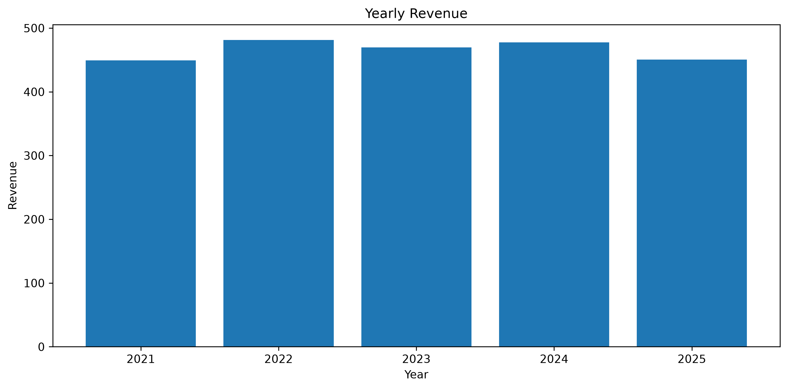
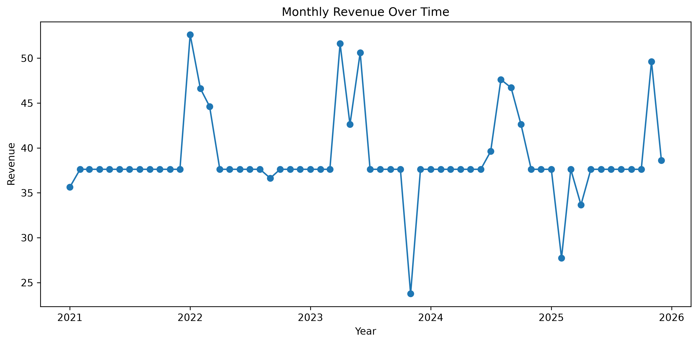
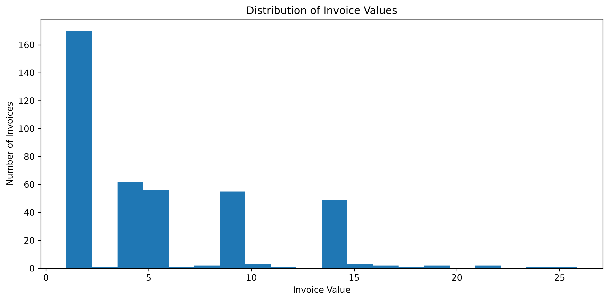
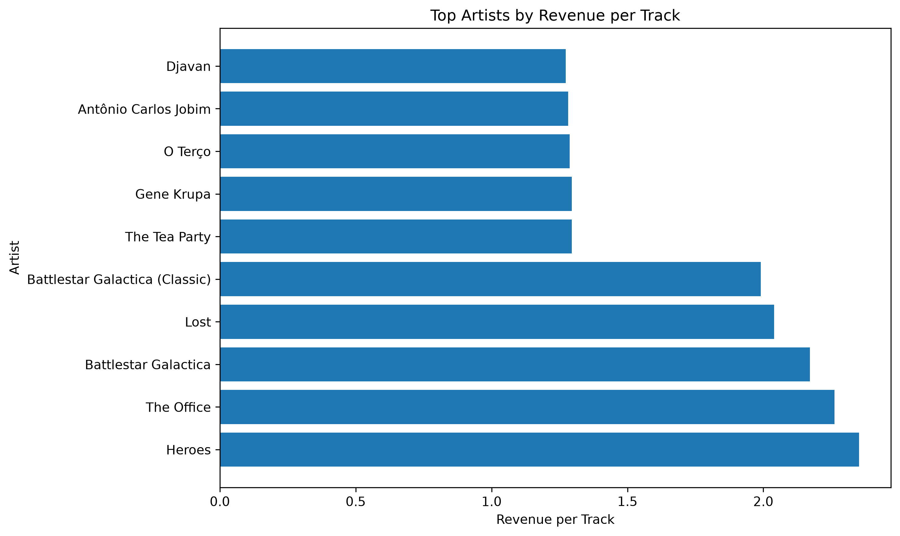
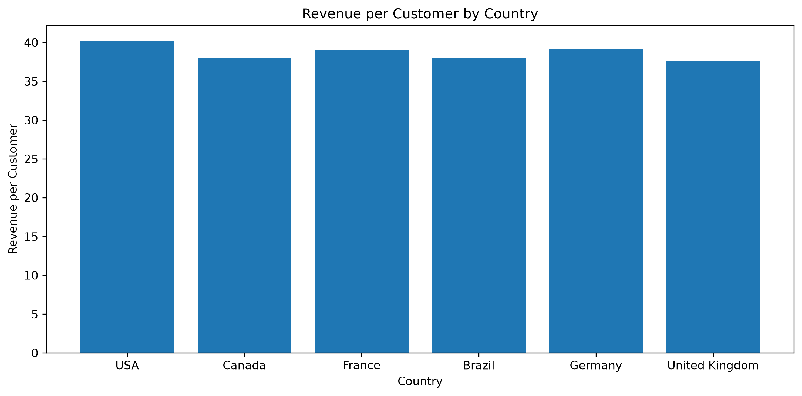

# Chinook Sales Analysis (SQL + Python)

**Business question:** Where does this music store's revenue actually come from, and is it healthy — or concentrated in a risky handful of customers and artists? A two-part project analyzing the Chinook database (a digital music store with customers, invoices, tracks, artists, albums, and genres). Phase one used pure SQL to explore and answer business questions directly in MySQL. Phase two moved into Python, connecting to the database with SQLAlchemy to extend the analysis with growth calculations, distributions, and visualizations.

## Key Insights
- Revenue is broad-based rather than concentrated: the top 10% of customers generate only about 11.97% of total revenue, spread fairly evenly rather than dependent on a few big spenders.
- Rock is the clear catalog leader, both by tracks sold (835) and revenue ($826.65) — the safest genre to keep stocked and promoted.
- Revenue-per-track tells a different story than total revenue: Heroes earns the most per track ($2.35) despite only 11 tracks, while Iron Maiden leads on total revenue ($138.60) but a lower per-track average ($1.13) — useful for spotting efficient catalog additions, not just big names.
- Revenue was fairly stable year to year, peaking in 2022 ($481.45, +7.12% from 2021) before declining slightly.
- The USA, Germany, and France have the highest average revenue per customer among countries with at least 3 customers — a useful signal for where to focus retention or marketing effort.

## Part 1: SQL Analysis
- Checked the database for null values and duplicate primary keys before starting analysis.
- Used JOINs across 4+ related tables (Track, Album, Artist, Genre, InvoiceLine, Customer, Employee) to answer each question.
- Used CTEs and window functions (`NTILE`, `RANK`) for percentile-based customer segmentation and per-genre artist ranking.

**Questions answered:**
- What is the overall sales performance? (total revenue, invoices, tracks sold, average invoice value)
- How does revenue change over time? (yearly, monthly, growth)
- Which countries generate the most revenue?
- Who are the top customers by spending, and what share of revenue do the top 10% represent?
- Which genres are the most popular, by both quantity sold and revenue?
- Which artists and albums generate the most revenue?
- Which employees manage the most customers and generate the most revenue?
- What is the average spending per customer?

**Additional findings:**
- The store generated $2,328.60 in total revenue across 412 invoices, averaging $5.65 per invoice.
- The USA generated the most revenue by far ($523.06), followed by Canada, France, and Brazil — matching where most customers are based.
- Minha Historia was the best-selling album by tracks sold.
- Jane Peacock managed the most customers (21) and generated the highest revenue ($833.04) among employees with assigned accounts.
- The average customer spent $39.47, and the top 10% of customers were fairly close in spending to one another (between $43.62–$49.62).

## Part 2: Python Extension
- Connected to the MySQL database from Python using SQLAlchemy, pulling query results directly into pandas with `pd.read_sql()`.
- Used pandas to calculate month-over-month revenue growth (`pct_change()`), invoice value distribution, and revenue-per-track/revenue-per-customer metrics.
- Visualized every finding with matplotlib and seaborn.

### Yearly Revenue

Revenue peaked in 2022 ($481.45), growing 7.12% from 2021, before declining slightly in the following years.

### Monthly Revenue Over Time

April 2023 was the strongest month that year ($51.62), while November 2023 saw an unusually low dip — the biggest driver of December's 58.33% month-over-month jump.

### Invoice Value Distribution

The average invoice value was $5.65, but the median was only $3.96 — a handful of higher-value invoices (up to $25.86) pulled the average up. Most invoices were relatively low, with 75% totaling $8.91 or less.

### Top Artists by Revenue per Track

Heroes had the highest revenue per track ($2.35) despite only having 11 tracks, while Iron Maiden had the highest total revenue ($138.60) but a lower per-track average ($1.13) — showing revenue-per-track can surface different standout artists than total revenue alone.

### Revenue per Customer by Country

Among countries with at least 3 customers, the USA, Germany, and France had the highest average revenue per customer, with fairly consistent spending across all of them.

## Tools
- MySQL, MySQL Workbench
- Python, pandas, SQLAlchemy
- matplotlib, seaborn
- Jupyter Notebook

## Dataset
Uses the Chinook sample database, a sample digital music store database commonly used for SQL practice.

## Author
Aya — MIS Student, Lebanese University
